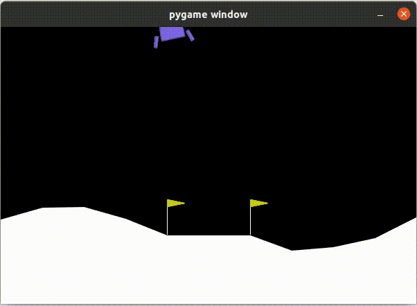
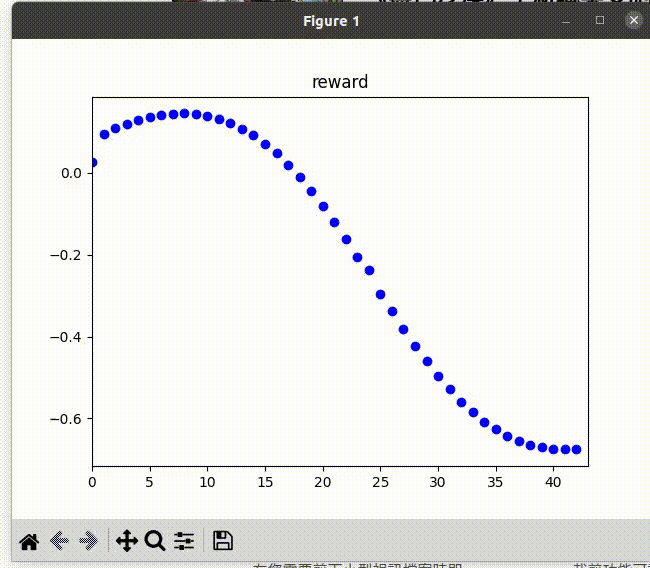
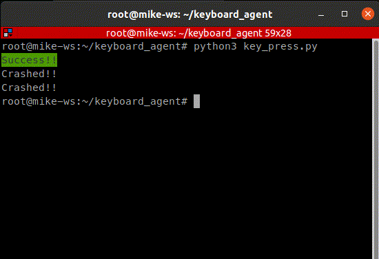

# keyboard_agent

This repo can use keyboard to control the agent in training environments.

Please pull the docker image 

```
docker pull argnctu/keyboard_agent:latest
```

for terminal 1
```
source docker_run.sh
```
other terminals
```
source docker_join.sh
```

to run the keyboard agent, please run 
```
python3 key_press.py
```
### To control the agent
**W** : fire the main engine  
**A** : fire right orientation engine  
**D** : fire left orientation engine  
  
you can see two windows pop up :
### lunar lander game 
<p align="center">
<br>
</p>

### plot of agent's reward  
<p align="center">
<br>
</p>

also, you can see the result of your lunar lander in terminal :  
success or crashed

<p align="center">
<br>
</p>
