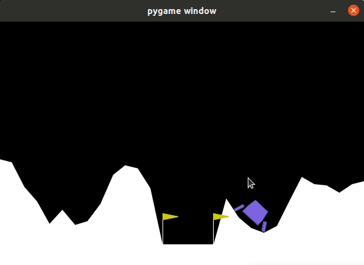

# keyboard_agent

This repo can use keyboard to control the agent in training environments.

Please pull the docker image 

```
docker pull argnctu/oop
```

For the first terminal,
```
source Docker/oop/docker_run.sh
```

To run the keyboard agent with customized gym env, please run 
```
source install_custom_gym.sh
cd scripts
python3 uav_lander_high_target.py
```

To run standard lunarlander
```
python3 scripts/lunar_lander_main.py
```

### To control the agent
**W** : fire the main engine  
**A** : fire right orientation engine  
**D** : fire left orientation engine  
  
you can see two windows pop up :
### lunar lander game 
<p align="center">
<br>
</p>

### plot of agent's reward  
<p align="center">
<br>
</p>

also, you can see the result of your lunar lander in terminal :  
success or crashed

<p align="center">
<br>
</p>

## UAV_Lander
If you want to run uav-lander, execute the following command after entering docker. \
There's a 'pip3 install -e uav_gym' command inside the 'install_custom_gym.sh' script. It'll register our custom gymnasium named "uav_gym."
```
source install_custom_gym.sh
cd scripts/
python3 uav_lander.py
```
you can see two windows pop up :
### uav lander game 
<p align="center">
<br>
</p>

### plot of agent's reward  
<p align="center">
<br>
</p>

also, you can see the result of your uav lander in terminal :  
success or crashed

<p align="center">
<br>
</p>
